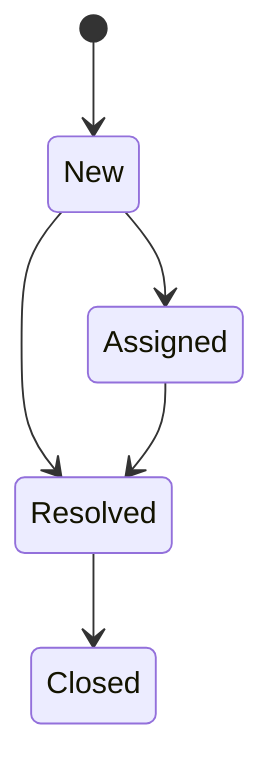

# Domain

A small internal support desk. Requesters raise tickets by email or web form,
agents work them, and the queue page is what an agent looks at all day.

## Entities

| Entity | What it is |
| --- | --- |
| `Agent` | Someone who works tickets. Agents who leave are kept, marked inactive, so their history stays attributed. |
| `Ticket` | One reported problem. Carries a human-facing `Reference` like `TKT-0042`, a priority, a status, and the requester's email. |
| `Comment` | One message on a ticket. Comments are either visible to the requester or **internal** — notes agents write for each other. |

## Priority

`Low`, `Normal`, `High`, `Urgent` — declared least to most severe. The queue is
meant to show the most severe work first so an agent picking up their next ticket
gets the right one.

## Status

`New` and `Assigned` are **open**. `Resolved` and `Closed` are not. "Open" is the
word used throughout the API: the queue lists open tickets, and an agent's
workload counts the open tickets assigned to them.

A ticket that is Resolved or Closed is finished. Nothing reopens it, and nothing
should be able to move it back to an open state.

## Conventions this codebase follows

- **Thin controllers.** A controller binds input, calls one service method, and
  returns the result. Domain decisions and database work live under
  `src/SupportTicketApi/Services`.
- **DTOs at the boundary.** Endpoints accept and return records from
  `src/SupportTicketApi/Dtos`. Entity classes never appear in a controller
  signature or a serialized response.
- **Errors are ProblemDetails.** Two exception types carry the contract:
  `NotFoundException` becomes `404`, `ConflictException` becomes `409`, and both
  are returned as `application/problem+json`. Throw them from a service; the
  middleware does the rest. Invalid input is a `400` from model validation, before
  anything reaches a service.
- **Times are UTC.** Every stored timestamp ends in `Utc` and is a UTC value.

## A known limitation

Internal comments exist in the database and have from the start, but nothing in
the API reads or writes them yet. Agents currently paste internal notes into a
separate chat tool, which is why the visibility flag has never been exercised.
